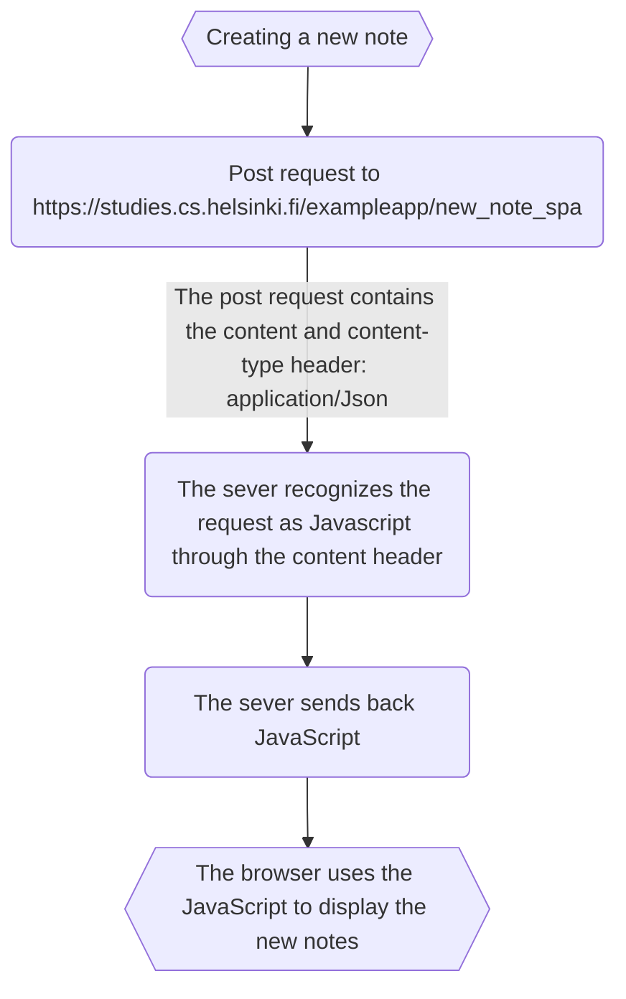

```mermaid
flowchart TD
  id1{{Creating a new note}} --> id2(Post request to https://studies.cs.helsinki.fi/exampleapp/new_note_spa)
  id2 --> |The post request contains the content and content-type header: application/Json| id3(The sever recognizes the request as Javascript through the content header)
  id3 --> id4(The sever sends back JavaScript)
  id4 --> id5{{The browser uses the JavaScript to display the new notes}}
```
