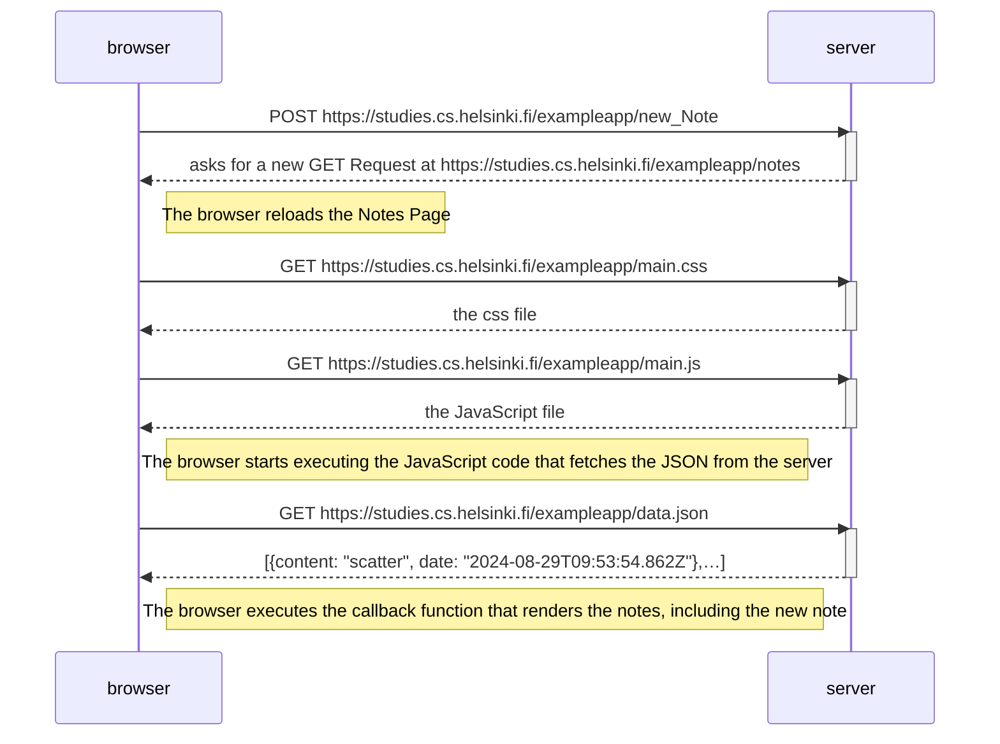

```mermaid
sequenceDiagram
    participant browser
    participant server

    browser->>server: POST https://studies.cs.helsinki.fi/exampleapp/new_Note
    activate server
    server-->>browser: asks for a new GET Request at https://studies.cs.helsinki.fi/exampleapp/notes
    deactivate server

    note right of browser: The browser reloads the Notes Page

    browser->>server: GET https://studies.cs.helsinki.fi/exampleapp/main.css
    activate server
    server-->>browser: the css file
    deactivate server

    browser->>server: GET https://studies.cs.helsinki.fi/exampleapp/main.js
    activate server
    server-->>browser: the JavaScript file
    deactivate server

    Note right of browser: The browser starts executing the JavaScript code that fetches the JSON from the server

    browser->>server: GET https://studies.cs.helsinki.fi/exampleapp/data.json
    activate server
    server-->>browser: [{content: "scatter", date: "2024-08-29T09:53:54.862Z"},…]
    deactivate server

    Note right of browser: The browser executes the callback function that renders the notes, including the new note
```
